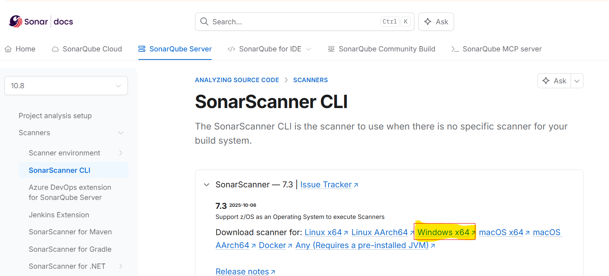
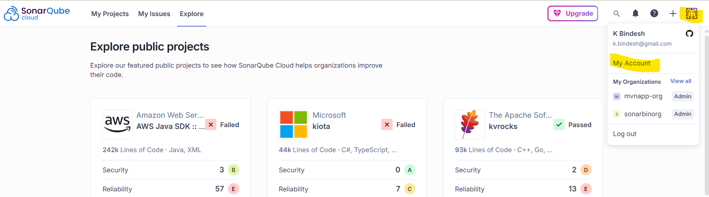

# Static Code Analysis using SonarQube (Cloud) on Win 11

## Overview

- In this article, you will learn how to use **SonarQube** for performaing static code analysis of a Maven project.
- We will integrate **SonarScanner** with Maven Project for analyzing a Java project.

## `Prerequisites` for reviewing the Maven project using SonarQube

- Windows 11 system (with admin rights)
- [Visual Studio Code](https://code.visualstudio.com/download)
- [Java (JDK 17 or above)](https://www.oracle.com/in/java/technologies/downloads/#java17-windows)
- [Maven](https://maven.apache.org/download.cgi)
- [Git](https://git-scm.com/install/windows)
- Internet Connectivity

## Step-01: Create a new Maven project

- Launch VS Code (IDE) >> Create a new project folder and open it in the VS Code >> **View** menu >> **Terminal**

  ```
  mvn archetype:generate "-DgroupId=com.mycompany.app" "-DartifactId=my-app" "-DarchetypeArtifactId=maven-archetype-quickstart" "-DarchetypeVersion=1.5" "-DinteractiveMode=false"
  ```

- Get inside the project folder:

  ```
  cd my-app
  ```

  - The **src/main/java** directory contains the project source code
  - The **src/test/java** directory contains the test source
  - The **pom.xml** file is the project's Project Object Model, or POM.

## Step-02: Compile and Build the Maven Project

```
# Validate the Maven project
mvn validate

# Compile the Maven project
mvn compile

# To see the output of your application
java '-XX:+ShowCodeDetailsInExceptionMessages' '-cp' 'target\classes' 'com.example.App'

# Package the Maven App
mvn package

# See the output of App using App build (.jar)
java -cp target/my-app-1.0-SNAPSHOT.jar com.example.App
```

## Step-03: `Setup SonarScanner CLI`

- Official SonarScanner CLI Download page: <br/> https://docs.sonarsource.com/sonarqube-server/10.8/analyzing-source-code/scanners/sonarscanner

- Download the **Windows x64** version of SonarScanner CLI and extract it.
  
- Copy the extracted folder, rename it to **sonar-scanner** and move it somewhere in the C: drive. Here, I've created a folder **Binaries** (C:\Binaries)

- The new location of sonar-scanner CLI app: C:\Binaries\sonar-scanner

  ```
  # Check the sonar-scanner version
  sonar-scanner -v

  [NOTE: In case VS Code is not recognizing the sonar-scanner, close it and relaunch]
  ```

## Step-04: `Set the Path of SonarScanner` on your System (Win11)

- Start menu >> **Edit the system environment variables** >> Advanced tab >> Click **Environment Variables** button >> Under **System Variables** section
- Select **Path** variable & click **Edit** >> Paste the SonarScanner's bin directory location (e.g. C:\Binaries\sonar-scanner\bin) >> Click Ok >> Ok.

## Step-05: Create a new SonarQube Cloud Account

- Navigate to https://sonarcloud.io/login >> Select **GitHub** >> Enter your GitHub credentials to login

## Step-06: Create `SonarQube Organization` and `Project`

### 6.1 Create a new `SonarQube Organization`

- Sign-in to SonarQube Cloud Account - https://sonarcloud.io/login
- From the right-top corner, click on **+** button >> **Create New Organization** >> create one manually.
  - **Organization Name**: bin_project_org
  - **Plan**: Free

### 6.2 Create a new `SonarQube Project`

- From the right-top corner, click on **+** button >> select **Analyze New Project** >> Click **create a project manually** link.
  - **Organization**: mvnapp-org
  - **Project Name**: mvn-project
  - **Project visibility**: Private
  - **The new code for this project will be based on**: Previous version

## Step-07: Generate a new SonarQube Authentication Token

- SonarQube Cloud Account >> From top-right corner, click user dropdown list and select **My Account** >> **Security** tab

  - **Token Name**: code-review



- Keep the generated auth token at safe place; you will need it in the next step.

## Step-08: `Update the POM.xml file` for sonarqube

### Step-8.1: Add sonar plugin for Maven

- Ref: https://mvnrepository.com/artifact/org.sonarsource.scanner.maven/sonar-maven-plugin/5.1.0.4751

- Open pom.xml file of your Maven project and add the following plugin in the `<plugins>` section:

```
<plugin>
  <groupId>org.sonarsource.scanner.maven</groupId>
  <artifactId>sonar-maven-plugin</artifactId>
  <version>5.1.0.4751</version>
</plugin>
```

### Step-8.2: Add SonarQube properties

- Ref: https://docs.sonarsource.com/sonarqube-server/10.8/analyzing-source-code/scanners/sonarscanner-for-maven

- Add the following sonarqube properties under the `<properties>` section of the **pom.xml** file (replace below sample project and org details with yours):

```
<sonar.host.url>https://sonarcloud.io</sonar.host.url>
<sonar.projectKey>mvnapp-org_mvn-project</sonar.projectKey>
<sonar.projectName>mvn-project</sonar.projectName>
<sonar.organization>mvnapp-org</sonar.organization>
<sonar.language>java</sonar.language>
<sonar.sourceEncoding>UTF-8</sonar.sourceEncoding>
<sonar.java.binaries>target/classes</sonar.java.binaries>
```

### Step-8.3: Updated `pom.xml` file

- After making above modifications, your updated pom.xml file will look something like this:

```
<?xml version="1.0" encoding="UTF-8"?>

<project xmlns="http://maven.apache.org/POM/4.0.0" xmlns:xsi="http://www.w3.org/2001/XMLSchema-instance"
  xsi:schemaLocation="http://maven.apache.org/POM/4.0.0 http://maven.apache.org/xsd/maven-4.0.0.xsd">
  <modelVersion>4.0.0</modelVersion>

  <groupId>com.example</groupId>
  <artifactId>demo</artifactId>
  <version>1.0-SNAPSHOT</version>

  <name>demo</name>
  <!-- FIXME change it to the project's website -->
  <url>http://www.example.com</url>

  <properties>
    <project.build.sourceEncoding>UTF-8</project.build.sourceEncoding>
    <maven.compiler.source>17</maven.compiler.source>
    <maven.compiler.target>17</maven.compiler.target>
    <sonar.host.url>https://sonarcloud.io</sonar.host.url>
    <sonar.projectKey>mvnapp-org_mvn-project</sonar.projectKey>
    <sonar.projectName>mvn-project</sonar.projectName>
    <sonar.organization>mvnapp-org</sonar.organization>
    <sonar.language>java</sonar.language>
    <sonar.sourceEncoding>UTF-8</sonar.sourceEncoding>
    <sonar.java.binaries>target/classes</sonar.java.binaries>
  </properties>

  <dependencies>
    <dependency>
      <groupId>junit</groupId>
      <artifactId>junit</artifactId>
      <version>4.11</version>
      <scope>test</scope>
    </dependency>
  </dependencies>

  <build>
    <pluginManagement><!-- lock down plugins versions to avoid using Maven defaults (may be moved to parent pom) -->
      <plugins>
        <!-- clean lifecycle, see https://maven.apache.org/ref/current/maven-core/lifecycles.html#clean_Lifecycle -->
        <plugin>
          <artifactId>maven-clean-plugin</artifactId>
          <version>3.1.0</version>
        </plugin>
        <!-- default lifecycle, jar packaging: see https://maven.apache.org/ref/current/maven-core/default-bindings.html#Plugin_bindings_for_jar_packaging -->
        <plugin>
          <artifactId>maven-resources-plugin</artifactId>
          <version>3.0.2</version>
        </plugin>
        <plugin>
          <artifactId>maven-compiler-plugin</artifactId>
          <version>3.8.0</version>
        </plugin>
        <plugin>
          <groupId>org.sonarsource.scanner.maven</groupId>
          <artifactId>sonar-maven-plugin</artifactId>
          <version>5.1.0.4751</version>
        </plugin>
        <plugin>
          <artifactId>maven-surefire-plugin</artifactId>
          <version>2.22.1</version>
        </plugin>
        <plugin>
          <artifactId>maven-jar-plugin</artifactId>
          <version>3.0.2</version>
        </plugin>
        <plugin>
          <artifactId>maven-install-plugin</artifactId>
          <version>2.5.2</version>
        </plugin>
        <plugin>
          <artifactId>maven-deploy-plugin</artifactId>
          <version>2.8.2</version>
        </plugin>
        <!-- site lifecycle, see https://maven.apache.org/ref/current/maven-core/lifecycles.html#site_Lifecycle -->
        <plugin>
          <artifactId>maven-site-plugin</artifactId>
          <version>3.7.1</version>
        </plugin>
        <plugin>
          <artifactId>maven-project-info-reports-plugin</artifactId>
          <version>3.0.0</version>
        </plugin>
      </plugins>
    </pluginManagement>
  </build>
</project>

```

## Step-09: Analyze the Maven project code using SonarQube

- In the VS Code terminal section, run the following maven command to initiate code validation and review process:

```
# Replace below token with your SonarQube cloud token
mvn clean verify sonar:sonar '-Dsonar.token=ee5742fbf94b37d69448595af94d9266980589c7'
```

## Step-10: Checkout the Code review result

- Navigate to your SonarQube cloud account - https://sonarcloud.io/projects

- Under the _main branch results_ section, you will find the summary and full result of the code analysis.
